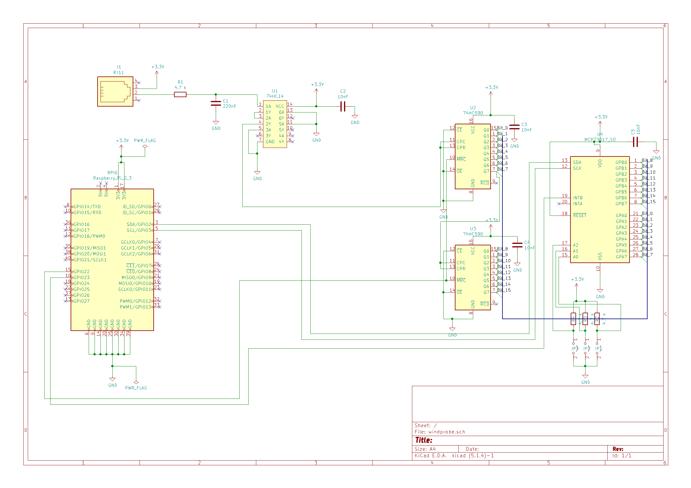

A complete list (we think) for the lab test components is under the meteo project folder (Test\_Lab\_Shopping\_list.xlsx) and listed later in the blog. Also we had to change a capacitor value (from 180nf to 220nf) and the schmitt trigger because it is very hard to find these items. We updated the schema accordingly. We didn't have time to go into detail how the mcp23017 interruptor works, thats up for the next time. But it looks very promising that the mcp23017 i/o expander is as customizable as we want it.

Here is a first shopping list. It's important to note that it is a mix of windprobe specific items, project specific, general tools and test setup. If everything works out as planned I will create a project only shopping list with the exact parts needed.

Windprobe specific (mostly)

- [Meteo station](https://www.argentdata.com/catalog/product_info.php?products_id=145) 68€
- [74HC14](https://www.amazon.de/POPESQ%C2%AE-74HC14-Schmitt-Flipflop-Sockel/dp/B07DT37Y85/ref=sr_1_1?__mk_de_DE=%C3%85M%C3%85%C5%BD%C3%95%C3%91&keywords=74HC14&qid=1576937429&sr=8-1) 7.40€
- [Serie E24 Resistors](https://www.amazon.fr/R%C3%A9sistance-Assortiment-400-pi%C3%A8ces-r%C3%A9sistances-20-standard/dp/B07CQFWVJL/ref=sr_1_fkmr0_1?__mk_fr_FR=%C3%85M%C3%85%C5%BD%C3%95%C3%91&keywords=lot+resistance+E24&qid=1576586149&sr=8-1-fkmr0) 2x 14.62€
- [Ceramic Capacitors](https://www.amazon.fr/BOJACK-condensateurs-monolithiques-c%C3%A9ramique-Capacit%C3%A9/dp/B07PP7SFY8/ref=pd_bxgy_328_img_2/257-6635116-7314721?_encoding=UTF8&pd_rd_i=B07PP7SFY8&pd_rd_r=a33e17f7-ad5c-4ed8-ac9f-093307b207f0&pd_rd_w=w9n4R&pd_rd_wg=LaEy1&pf_rd_p=6f987254-9a2f-416c-82f5-9555ce4bf24d&pf_rd_r=BSC7EJKK86G9VXGEZPQ5&psc=1&refRID=BSC7EJKK86G9VXGEZPQ5) 12€
- [Serie E24 Capacitors](https://www.amazon.fr/BOJACK-dassortiment-condensateur-%C3%A9lectrolytique-0-1uF-1000uF/dp/B07PN5P64W/ref=sxbs_sxwds-stvp?__mk_fr_FR=%C3%85M%C3%85%C5%BD%C3%95%C3%91&keywords=condensateur+MKP+lot&pd_rd_i=B07PN5P64W&pd_rd_r=7e2db12e-5b14-4f19-8c0b-82a6a0b510d5&pd_rd_w=NLFep&pd_rd_wg=MkfY0&pf_rd_p=b5ee69d3-6381-4897-8a23-e5b0b965bfb9&pf_rd_r=A3B3BG0V87ASFRAFGBTW&qid=1576586658&s=industrial) 19€
- [74HC590](https://www.gotronic.fr/art-74hc590-10100.htm) 10x 0.8€
- [MCP23017](https://www.amazon.fr/Pi%C3%A8ces-MCP23017-Expander-compatible-Arduino/dp/B00P12065Q/ref=sr_1_1?__mk_fr_FR=%C3%85M%C3%85%C5%BD%C3%95%C3%91&keywords=MCP23017&qid=1576585211&sr=8-1) 18.81€
- [RJ45-Breakout](https://www.amazon.fr/Electronics-Salon-blind%C3%A9-Breakout-Terminal-connecteur/dp/B00U2DZOTM/ref=sr_1_1?__mk_fr_FR=%C3%85M%C3%85%C5%BD%C3%95%C3%91&keywords=rj45+board&qid=1576587299&sr=8-1) 10.2€

General items or tools for either testing or for the entire station.

- [Labtest connectors](https://www.amazon.fr/Elegoo-Breadboard-Femelle-Longueur-Arduino/dp/B01JD5WCG2/ref=sr_1_5?__mk_fr_FR=%C3%85M%C3%85%C5%BD%C3%95%C3%91&keywords=dupont+connecteur&qid=1576585908&sr=8-5) 7€
- [Dupont Connector kit](https://www.amazon.fr/Preciva-Sertissage-Sertisseuse-Connecteurs-Connecteur/dp/B07QY7K5SW/ref=sr_1_4_sspa?__mk_fr_FR=%C3%85M%C3%85%C5%BD%C3%95%C3%91&keywords=dupont+connecteur&qid=1576585908&sr=8-4-spons&psc=1&spLa=ZW5jcnlwdGVkUXVhbGlmaWVyPUExOUEwR0I3NDhMM0RRJmVuY3J5cHRlZElkPUEwMjQyNTM5TDFTVEEzT1kzODhKJmVuY3J5cHRlZEFkSWQ9QTA1MTcxMjQxSkxZSzZaRUZJNzZDJndpZGdldE5hbWU9c3BfYXRmJmFjdGlvbj1jbGlja1JlZGlyZWN0JmRvTm90TG9nQ2xpY2s9dHJ1ZQ==) 37€
- [Labtest Board](https://www.amazon.fr/BeMatik-dessais-l%C3%A9lectronique-Planche-prototypage/dp/B07JHKYWTZ/ref=sr_1_16?__mk_fr_FR=%C3%85M%C3%85%C5%BD%C3%95%C3%91&keywords=plaque+essai&qid=1576586866&s=industrial&sr=1-16) 30.8€
- [Lab test raspberry breakout](https://www.amazon.fr/DollaTek-Carte-dextension-Breakout-Raspberry/dp/B07DK4XDLW/ref=pd_sbs_107_9?_encoding=UTF8&pd_rd_i=B07DK4XDLW&pd_rd_r=99f7a7e3-dd61-4d79-8fc9-4450ecf584db&pd_rd_w=joAWD&pd_rd_wg=mFIuN&pf_rd_p=a9f5d7c2-08ef-42e9-9709-9c2a12683b28&pf_rd_r=Q8EFM19GHCTBEQHWE13E&psc=1&refRID=Q8EFM19GHCTBEQHWE13E) 7€
- [POE Switch](https://www.amazon.fr/PS504-Switch-Power-Ethernet-802-3af/dp/B071DK16B2/ref=sr_1_3?__mk_fr_FR=%C3%85M%C3%85%C5%BD%C3%95%C3%91&crid=1M52FZGGJU0G&keywords=poe+switch+4+port&qid=1576585720&sprefix=POE+switch%2Caps%2C178&sr=8-3) 40€
- [RPI-4 starter kit](https://www.gotronic.fr/art-kit-raspberry-pi-4-b-kit-pi4-4gb-30856.htm) 105€
- [RPI-POE](https://www.gotronic.fr/art-module-poe-pour-raspberry-pi3-b-ada3848-29026.htm) 18.4€
- [Labtest connectors](https://www.amazon.fr/Elegoo-Breadboard-Femelle-Longueur-Arduino/dp/B01JD5WCG2/ref=sr_1_5?__mk_fr_FR=%C3%85M%C3%85%C5%BD%C3%95%C3%91&keywords=dupont+connecteur&qid=1576585908&sr=8-5) 7€

As always, the Github is here: [https://github.com/TheCell/Weatherstation](https://github.com/TheCell/Weatherstation)
