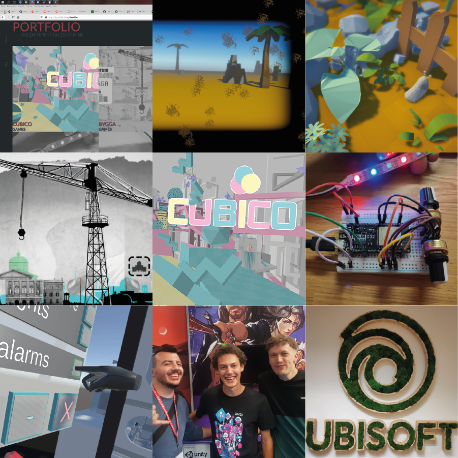
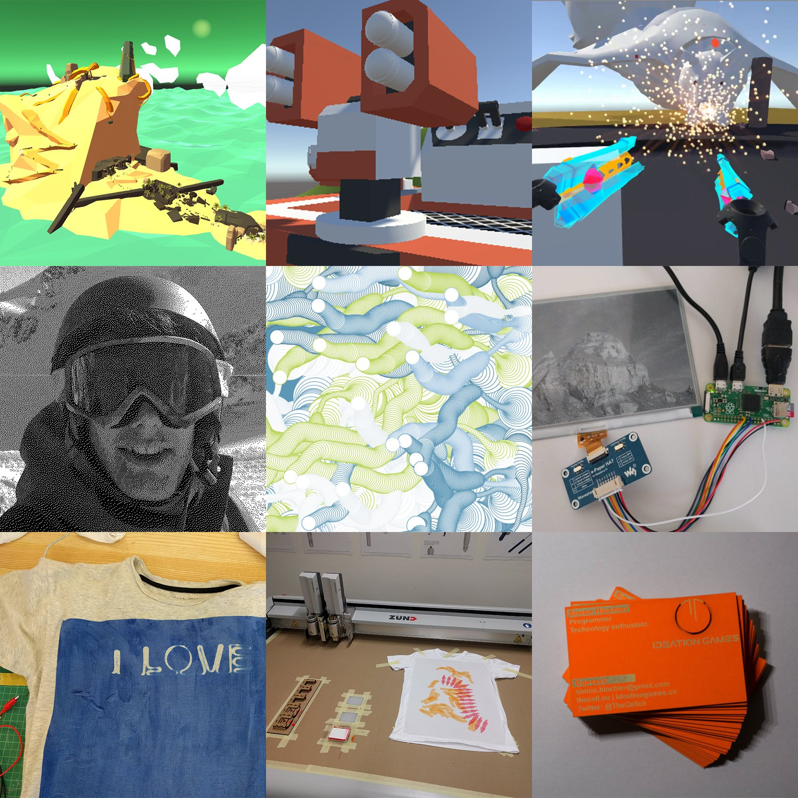

As every year, I want to have my best 9 dev/gamedev moments of the year 2019 as an image. The purpose of these is for me to look back and appreciate what I accomplished in 2019. We tend to not think about how far we have come or what we have done during the year and sometimes it is good to take a moment to reflect on that.

Here is some context to that: 1,2,3 is top row, 4,5,6, is middle row, 7,8,9 is bottom row.

1. [Portfolio Website](https://portfolio.blog.thecell.eu/2019/12/10/portfolio-website/): I build a Wordpress theme from scratch including designing and everything. There is more written if you click the link.
2. [Don't touch cacti](https://thecell.itch.io/dont-touch-cacti): Flo and me did a weekly gamejam from itch.io. This was the first Android game and the objects are procedurally placed. You look around to avoid the objects and you need to swipe dirt off the screen. While running you get faster and faster.
3. [Buttoni](https://portfolio.thecell.eu/2019/06/23/global-game-jam-2019-buttoni/): In January I participated in the global game jam and as a team of 3 we created a game where you have to find out what buttons to press and how. The theme was "What home means to you" and that's why every character has to get "home".
4. [Bygga](https://portfolio.thecell.eu/2019/10/24/bygga/): Our first commercial project. We did a game for an architecture company for their anniversary.
5. [Cubico](https://portfolio.thecell.eu/2019/11/02/cubico/): The Bachelors Game! We even uploaded it to Steam and it got picked up by a small speedrun community. We patched the game several times since and release the OST as DLC.
6. [1D Tetris](https://portfolio.thecell.eu/2019/06/23/1d-tetris/): At the Ludicous Festival I slipped into a hardware workshop where we got to play with LED stripes. Florian and me created a 1D tetris and we then finished the project off. It is now somewhere in the university to play.
7. [Leap Motion X VR](https://portfolio.thecell.eu/2019/10/23/leap-motion-x-htc-vive/): During winterschool at our university We got the opportunity as a team of 3 to come up and develop interactable Interfaces in VR. We got to play with VR and a leap motion and combined the two.
8. Gamescom: I had the opportunity to be at the Gamescom as a booth attendand for Kitfox games (http://www.kitfoxgames.com/en) we were allowed to showcase their new game Boyfriend Dungeon. This was the first time I really felt like part of the games industry and I loved every second of it. (The hotdogs though..)
9. Ubisoft Internship: I finished my University degree in computer science and arts. Starting in october I got the opportunity for an internship at Ubisoft. I am part of a new team at the HQ and we are doing research and ideation.

This image was from last year because I didn't post a blogpost about it. [https://twitter.com/TheCellch/status/1076553592591577089](https://twitter.com/TheCellch/status/1076553592591577089)

Here are my [#bestnine2018](https://twitter.com/hashtag/bestnine2018?src=hashtag_click) projects of #2018 with links top row 1,2,3. Middle is 4,5,6. [#screenshotsaturday](https://twitter.com/hashtag/screenshotsaturday?src=hashtag_click)[#gamedev](https://twitter.com/hashtag/gamedev?src=hashtag_click)[#bestnine](https://twitter.com/hashtag/bestnine?src=hashtag_click) Links are from [https://thecell.page.link/b9181](https://t.co/VXkI2eefYA?amp=1) to [https://thecell.page.link/b9189](https://t.co/cN3Fp6BQyy?amp=1) replace the X in ([https://thecell.page.link/b918X](https://t.co/bqmymlxsUJ?amp=1)) with the image number 1 to 9.
