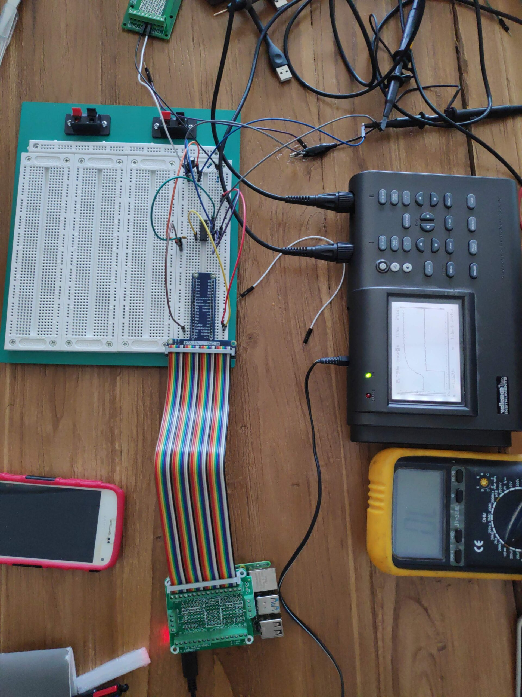
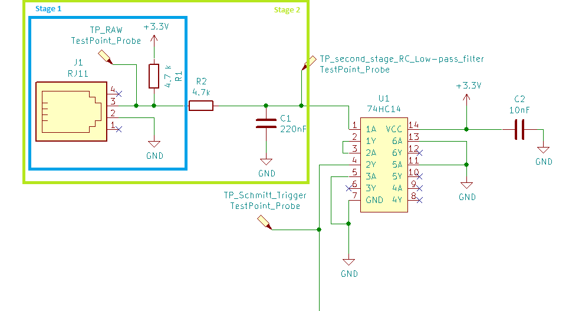
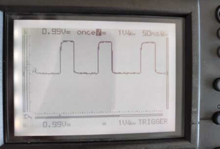
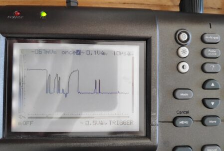
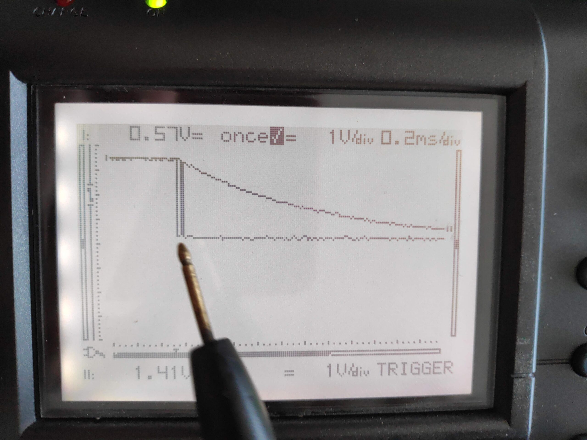
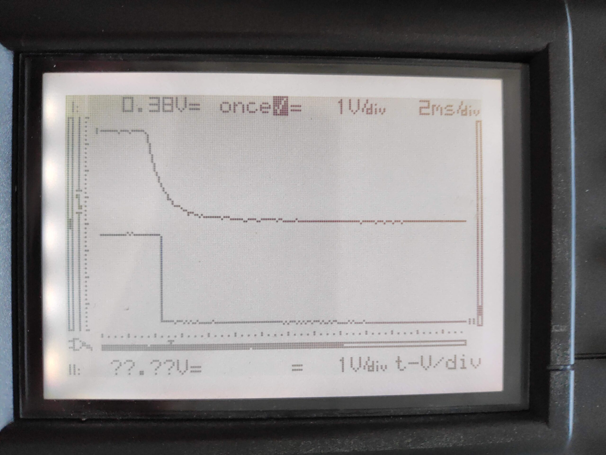
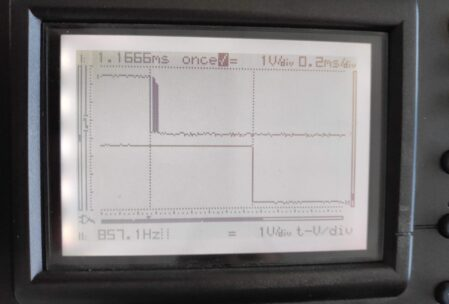
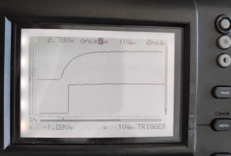

Hello everyone. It's been a while and Christmas, holidays and people having time off comes to a conclusion. This post is all about getting our hands on the ordered material and testing parts of our circuit for the first time. We already found an error in our schema with how the windprobe is included. I changed it to reflect our corrected test setup. The additional resistor (R2) is needed to not short out the Capacitor from the filtering stage every time the probe closes the circuit.

<figure>

<figcaption>

The final setup looked like this

</figcaption>

</figure>

For the testing we started with the Resistor Capacitor (RC) Low-pass filtering and once that was confirmed we added the Schmitt-Trigger and measured that. The following diagram shows where the Probes were connected in the setup.

The rest of this blog will just comment our findings and show the oscillator measures.

<figure>

<figcaption>

RAW Input zoomed out

</figcaption>

</figure>

<figure>

<figcaption>

RAW Input zoomed in

</figcaption>

</figure>

Here we can see a zoom in on the raw input. When the probe is closed the circuit is grounded resulting in a tension fall off. What we can see here is, that the voltage drops but has some noise before it finally reaches zero. In fact with this signal we would already count ~7 rotations instead of 1.

<figure>

<figcaption>

RAW Input vs Second Stage RC Low-pass filtered

</figcaption>

</figure>

Here you can see 2 probe measures on top of each other. The falling edge as RAW has some noise and the measure after the Second Stage RC Low-pass filter stage (the capacitor) which is gradually lowering the voltage without much noise. That's a good sign already but we want a sharp and certain off to have multiple counts during the transition period.

<figure>

<figcaption>

Second stage RC Low-pass filter vs Schmitt Trigger

</figcaption>

</figure>

Now we see the signal measured after the second stage RC Low-pass filter and after the schmitt-trigger. As you can see the signal is very clean now and once it's grounded, after a short period it is switched off suddenly.

<figure>

<figcaption>

RAW Input vs Schmitt-Trigger

</figcaption>

</figure>

And here is the final comparison very zoomed in for the falling edge. We compare the raw input with the output of the second stage RC Low-pass filter and schmitt-triggered output.

<figure>

<figcaption>

Second stage RC Low-pass filter vs Schmitt-Trigger

</figcaption>

</figure>

And at last here is an image of the rising edge after the second stage RC Low-pass filter and after the schmitt-trigger for completeness.

We are very satisfied with the setup of the windprobe, next time we will continue integrating more of the circuit to confirm the counters work like we planned them to work.

Github Link: [https://github.com/TheCell/Weatherstation](https://github.com/TheCell/Weatherstation)
