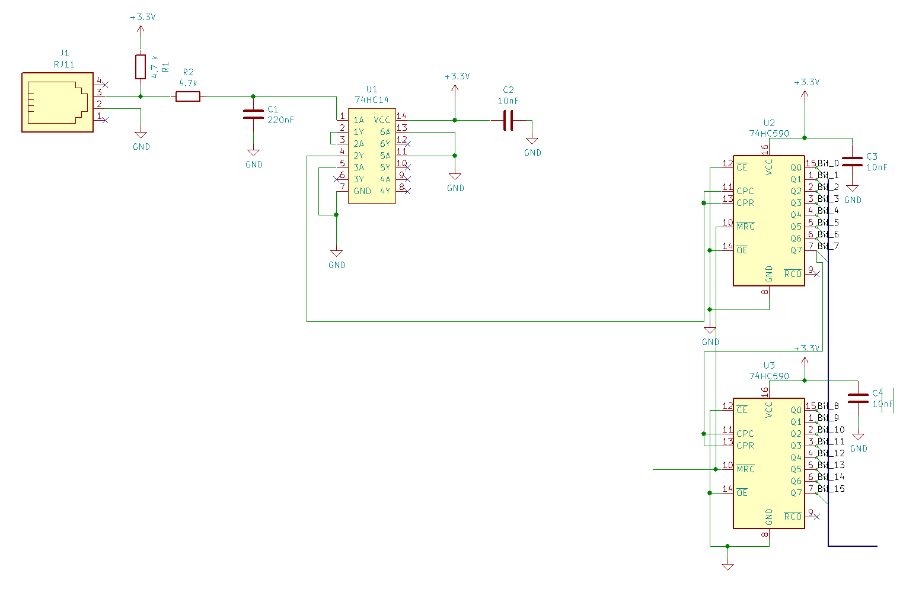
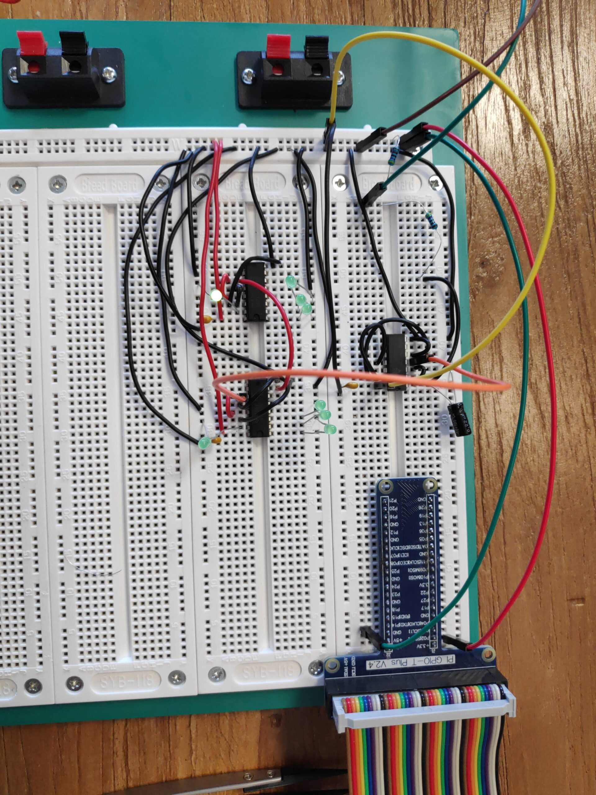

We continued verifying our current design and implemented the next part of the schema: The counter. We verified the counters by plugging LEDs in the according bits and looked if it's counting correctly. In the video we cheated the second counter by plugging the input on another bit of the first counter, so we don't have to rotate the sensor fan forever. For the counters we didn't have to change the schematics we planned.

<figure>

<figcaption>

Schematics for the implementation

</figcaption>

</figure>

## The tiny capacitors and filters

Prepare for a unsitific and kind of educated guess part below. Don't take this for the truth without doing your own research on this:

We did not really explain why there are tiny 10nF capacitors at the power entrance of passive elements. And I'll have a word about high and low-pass filters. The 10nF capacitors are called decoupling capacitors and they **must be unpolarized** to work. The tiny capacitors are multipurpose. One purpose is that the decoupling capacitors add fast "charge storage" near the IC. Additionally the decoupling capacitors and the pass-filters act as a kind of "lightning rod" to get rid of high or low frequency noise in the power. This is because capacitors can be seen as a short-circuit when super high or very low frequencies are applied. Take a look at Wikipedia for a more scientific explanation on this: [https://en.wikipedia.org/wiki/Decoupling\_capacitor](https://en.wikipedia.org/wiki/Decoupling_capacitor)

Besides this we started setting up a private WLAN and started configuring the Raspberry. More on the Raspberry at a later point.

Github Link: [https://github.com/TheCell/Weatherstation](https://github.com/TheCell/Weatherstation)
