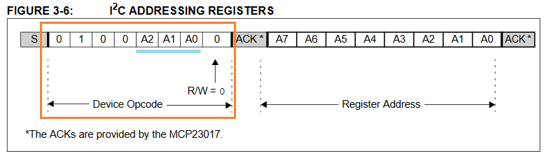

## Hardware

This post summarises 2 sessions. We added a pull-up Resistor between the Raspberry and the probes counter reset line to remove uncertain behaviour in case the raspberry is booting up or is unconnected. You can get rid of the uncertain behaviour by just resetting the MCP and the counters but practices helps remembering :).

<figure>

<figcaption>

Pull-up resistor at the counter

</figcaption>

</figure>

Further we found out, that the windprobe we ordered sends a pulse every 1/2 turn and not as anticipated once per turn. This we will need to keep in mind for the counting and to make sure our filter is not cutting off the maximum windspeed we were aiming for.

Brice introduced us to the basics of a bus. These limitations have to be kept in mind because there is signal bouncing happening in the bus. (Think of it kind of like water ripples if you build a physical water channel model of the bus and produce ripples on one end. The ripples bounce of the ends and bounce back to the producer, creating noise.)

- The bus needs pull-up Resistors at the end of the line.
- A bus can never be a star configuration ([https://en.wikipedia.org/wiki/Star\_network](https://en.wikipedia.org/wiki/Star_network))
- All devices on the bus have to physically come one after another on the bus.
- The connection between the device and the bus should be as short as possible.

<figure>

<figcaption>

windprobe schema

</figcaption>

</figure>

<figure>

<figcaption>

final setup

</figcaption>

</figure>

## Software

Our setup now is a wifi router connected to the internet, the raspberry connected via lan to the router and a laptop connected to the router aswell. We found the IP address of the raspberry on the router and connected to the raspberry via ssh (we use putty to connect (192.168.1.159:22 for us)).

To configure the raspberry to work via ssh check this raspberry manual page: [https://www.raspberrypi.org/documentation/remote-access/ssh/](https://www.raspberrypi.org/documentation/remote-access/ssh/) (Enable SSH on a headless Raspberry Pi (add file to SD card on another machine)). Once we logged in on the raspberry we run 2 commands.

- sudo apt update
- sudo apt install i2c-tools

After that we have to enable i2cdetect to finally be able to read from our bus. To configure we write "**raspi-config**" navigate to 5 (Interface) and then I2C enable.

Now everything is set to check our bus. As you can see we have our device (here as 20) on the bus address 0x20 (column 0, row 20). The device is 20 because we configured the hardware pins to be 000 by grounding all 3 of them. The 4 predefined Bits are 0100. This means our Device is Binary 0**b**01000000 which in Hex is 0**x**20.

<figure>

<figcaption>

Device Opcode

</figcaption>

</figure>

<figure>

<figcaption>

Before enabling i2c and after

</figcaption>

</figure>

After a light reading in the manual we found how to read the bits. To program the MCP we will have to do a deep dive into the MCP datasheet ( [http://ww1.microchip.com/downloads/en/devicedoc/20001952c.pdf](http://ww1.microchip.com/downloads/en/devicedoc/20001952c.pdf)) to check if everything works we just use the raspberry with the command "**i2cget -y 1 0x20 0x12**" and "**i2cget -y 1 0x20 0x13**". See the i2c manual here ( [https://www.waveshare.com/wiki/Raspberry\_Pi\_Tutorial\_Series:\_I2C](https://www.waveshare.com/wiki/Raspberry_Pi_Tutorial_Series:_I2C) and here [https://linux.die.net/man/8/i2cget](https://linux.die.net/man/8/i2cget))

- i2cget: read bytes
- \-y: Disable interactive mode
- 1: Indicates the number or name of the I2C bus to be scanned.
- 0x20: Address of the MCP I/O extension
- 0x12: Addres in the MCP to read the first 8 bits, see next screenshot
- 0x13: Addres in the MCP to read second 8 bits, see next screenshot

<figure>

<figcaption>

Datasheet GPIO Address

</figcaption>

</figure>

<figure>

<figcaption>

Reading form the i2c multiple times

</figcaption>

</figure>

As you can see by turning the probe and reading the registers the number is increasing. Once we pass 0xFF it is reset to 0 and we can read on the second Bit bank.

Github Link: [https://github.com/TheCell/Weatherstation](https://github.com/TheCell/Weatherstation)
