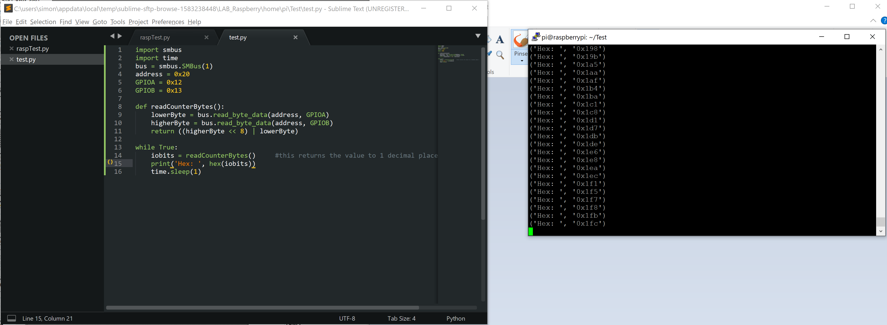

This session we started to work with Python to read the data. The final dataflow Brice suggested ([http://www.ulm-experience.com/](http://www.ulm-experience.com/)) should look something like this: I2C -> MQTT -> Telegraf -> InfluxDB -> Grafana. For now python is in charge of reading the I2C data.

## Hardware

We found another flaw in the schematics. The second counter is not counting correctly, it is counting once the highest bit of the first counter turns to 1 (hence at 1000 0000 or in hex 0x80) instead of at 1111 1111 to (1)0000 0000. To solve this we use the RCO output of the counters instead of the highest bit.


## Software

We wrote a small python script to be able to read the values from the two counters and verify that they are counting correctly. For this to work we start a putty ([https://www.putty.org/](https://www.putty.org/)) SSH connection and a WinSCP connection ([https://winscp.net/eng/index.php](https://winscp.net/eng/index.php)). I use Sublime ([https://www.sublimetext.com/](https://www.sublimetext.com/)) and the SFTP package ([https://packagecontrol.io/packages/SFTP](https://packagecontrol.io/packages/SFTP)). With that I can write python code directly on the raspberry with a remote sublime connection and then run the script in the SSH with putty.

On the raspberry you create a folder named "Test" in the home directory (/home/pi/) and create a file named **test.py**. The code looks like this:

```python
import smbus
import time
bus = smbus.SMBus(1)
address = 0x20
GPIOA = 0x12
GPIOB = 0x13

def readCounterBytes():
	lowerByte = bus.read_byte_data(address, GPIOA)
	higherByte = bus.read_byte_data(address, GPIOB)
	return ((higherByte << 8) | lowerByte)

while True:
	iobits = readCounterBytes()
	print('Hex: ', hex(iobits))
	time.sleep(1)
```

To run the python you switch to the "Test" folder and the run it with "**python test.py**"

<figure>



<figcaption>

Python to readout

</figcaption>

</figure>

If you want to work with sublime you have to configure the raspberry server connection in SFTP. My file looks like this:

```
{
    // The tab key will cycle through the settings when first created
    // Visit http://wbond.net/sublime_packages/sftp/settings for help
    
    // sftp, ftp or ftps
    "type": "sftp",

    "sync_down_on_open": true,
    "sync_same_age": true,
    
    "host": "192.168.1.159",
    "user": "PI_USERNAME",
    "password": "PI_PASSWORD",
    "port": "22",
    
    "remote_path": "/home/pi/",
    //"file_permissions": "664",
    //"dir_permissions": "775",
    
    //"extra_list_connections": 0,

    "connect_timeout": 30,
    //"keepalive": 120,
    //"ftp_passive_mode": true,
    //"ftp_obey_passive_host": false,
    //"ssh_key_file": "~/.ssh/id_rsa",
    //"sftp_flags": ["-F", "/path/to/ssh_config"],
    
    //"preserve_modification_times": false,
    //"remote_time_offset_in_hours": 0,
    //"remote_encoding": "utf-8",
    //"remote_locale": "C",
    //"allow_config_upload": false,
}
```

Link to the Github: [https://github.com/TheCell/Weatherstation](https://github.com/TheCell/Weatherstation)
