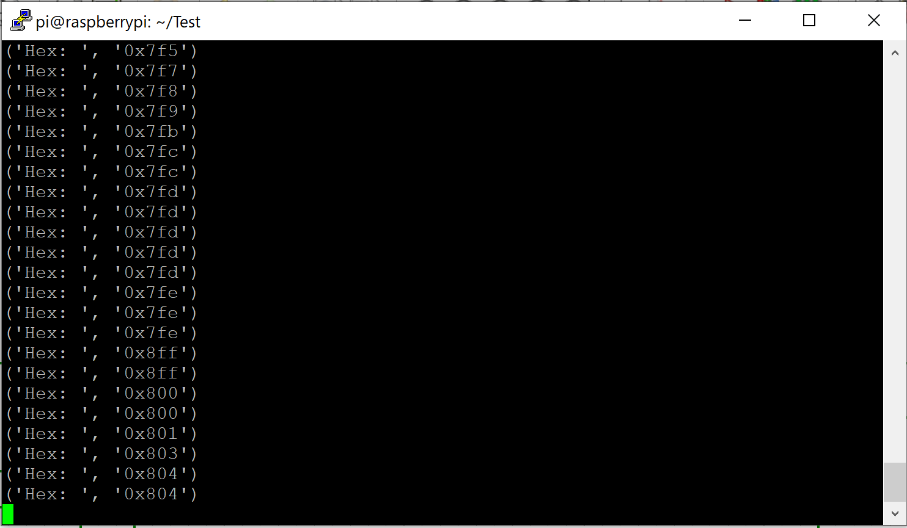
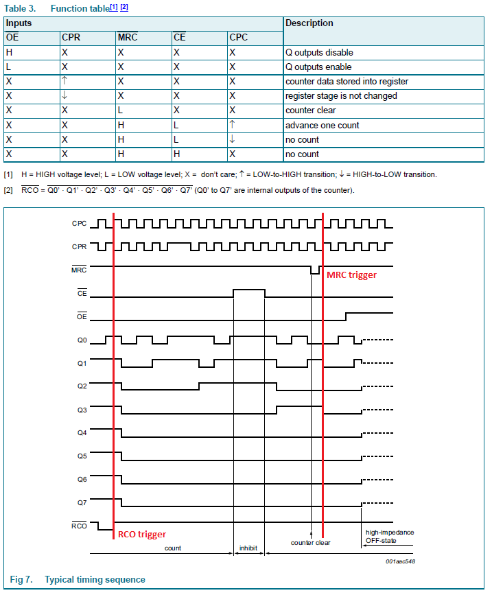

Summary of today: We will not work with the counter reset for the time beeing, we might change it or remove it completely in the final product. To learn why we ended up with that decision read on.

What you see is the same Python test program we wrote the last week. We wanted to confirm that the counters are working. We can confirm, that the change we made solved the issue with increasing the second counter too early. However, if we look closely into the counter we see this:  
0x7FE  
0x8FF  
0x800  
The second counter increases and then the first one is reset to 00. It might be not important because the counting still works as intended just the increase is a tick too fast. But we need to keep that in mind if we write the program! Otherwise when we read the values at exactly this time we end up beeing wrong by a full 0xFF or 255 counts.

After further testing, we encountered a big problem: The MRC trigger does not reset the counter instantly, there needs to be another CPC tick. This is fine for the first counter, but the second counter gets this pulse only after the first counter has counted to 255. So send the reset command and we have to wait for the first counter to clock up to 255 again to send one pulse to finally reset the second counter. We could add additional hardware to work with that, but for the time being we shift the solution to the software side and don't use the resets at all.
