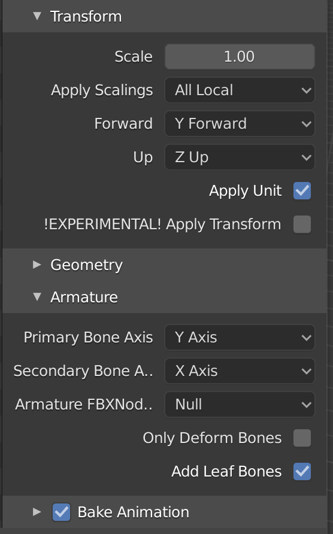

When I started an Inverse Kinematics tutorial I was left with a lot of questions. A problem about custom IK is getting your own models working. I use Blender as my goto tool when it comes to models. The problem is that different programs use different coordinate systems and different orientations for it. I will walk through the steps to get a model created and rigged in Blender to Unity.

First I model an object facing the y+ direction in Blender. Here I will do a simple robot arm and an arrow indicator at the bottom. Please ignore that there is already a bonechain / rig in this one. I took the screenshot at the end.

Now we want to add a Rig. For this we deselect everything and go to Add > Armature. Make sure to select the Armature and now switch to edit mode. To help visualize where the bones are look on the right under "Viewport Display" is the option to display "In Front". You simply click the small sphere, then "E" for extrude and add bones the way you like it.

Once you are satisfied with the model and the rig you can combine the two. You do this in Blender object mode. First select all Objects and then in the list select the armature. Rightclick > Parent > Armature Deform > With Automatic Weights.

The objects should be part of the armature after you did this. Like in the screenshot below.

You can check if everything is good and ready to export. For this you select the Pose Mode and then a bone. Move the bone around to see how it behaves.

## Make it look robotic

In my case I want bones to controll a single object part. I don't have soft tissues that are kind of transformed. I want the robotic look. For this to work we will have to change the weightpainting. A good and to the point tutorial I found was this.

https://www.youtube.com/watch?v=haBMilkToFE

So we go through all the objects and all the bones to correct the influence. In Objectmode select an object, switch to weight paint mode and then click through the bones (the tab Object Data Properties) either painting it fully red or fully blue (add or subtract). To switch the object you want to paint you go back to object mode, select the next object and turn weight painting on again.

## Export

Now exporting is not quite strait forward. We want to set the forward direction. Set the Forward to "Y Forward" and check that under "Armature" the Primary Bone Axis is the Y Axis.

## Now to Unity

Once the FBX file is loaded in Unity we have to change an input setting and we are good. We select the point "Bake Axis Conversion" and apply. This changes the joints local directions from y as forward to the usual z axis is forward. We also want to take Convert Units out. This means that we have to rescale the armature inside of the model.

For the rescaling we drag the model into our scene and it will be massive. Open up the model in the inspector and change the armature scale from 100 to 1 and set the y position again.

Now we can use the model and the rig in Unity. If you want to use it for Inverse Kinematics you reference the transforms in the armature. The object meshes are outside of the armature but you can rotate the mesh with the armature handles.

