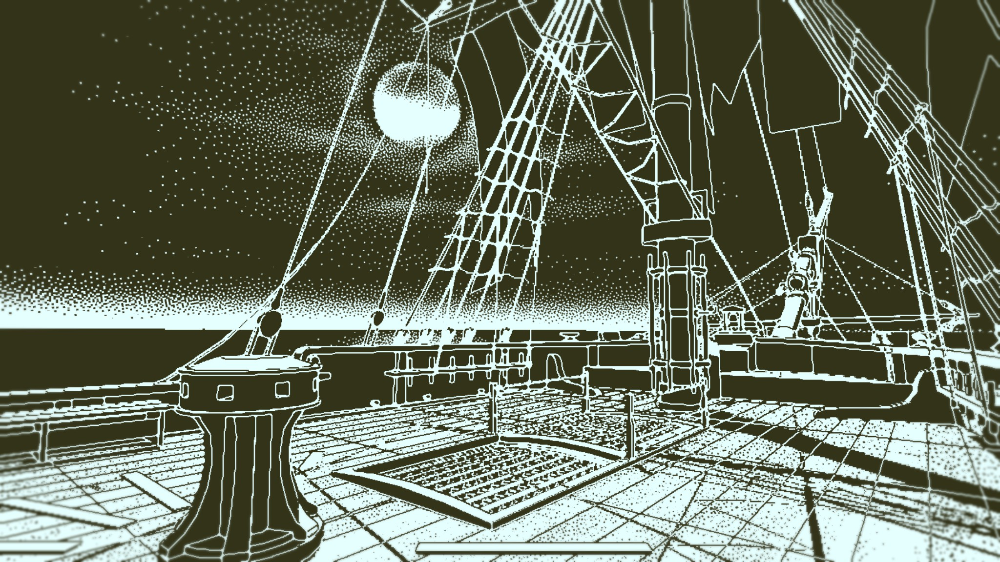

First things first: I did not know what I was getting into, but I knew that the game will be good. I can say now: Lucas Pope, you made a great game!

It starts out with you getting to the ship and after a short walk you pull out a clock and a book. The book lists 60 people who were on the Obra Dinn when it left. You have to figure out what happened to them and you do this by hearing the dialogue shortly before a person dies and then you find yourself in a still frame, the moment a person died.

Every chapter represents a different event and boy this got wild. On top: The music in the game is really awesome (check out the youtube video). Everytime you solve 3 fates you get rewarded by a short sound queue that I will miss. The graphics is basically some sort of dithering known from the 80s and early days of the internet. It does work very well when it's animated. It fits the gameplay so well and reduces visual false clues.

https://youtu.be/SX5RJ4OgvPM?t=540

And as always, here are the best of Screenshots and you can find the entire set of screenshots on my Steam profile here [https://steamcommunity.com/id/Thecell/screenshots/?appid=653530&sort=oldestfirst&browsefilter=myfiles&view=imagewall](https://steamcommunity.com/id/Thecell/screenshots/?appid=653530&sort=oldestfirst&browsefilter=myfiles&view=imagewall).

https://imgur.com/a/Xp3WSmq

As a little bonus here is the door transition.
