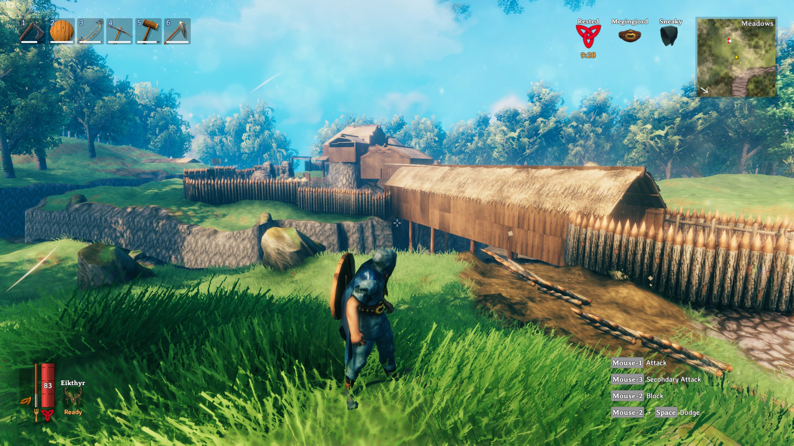
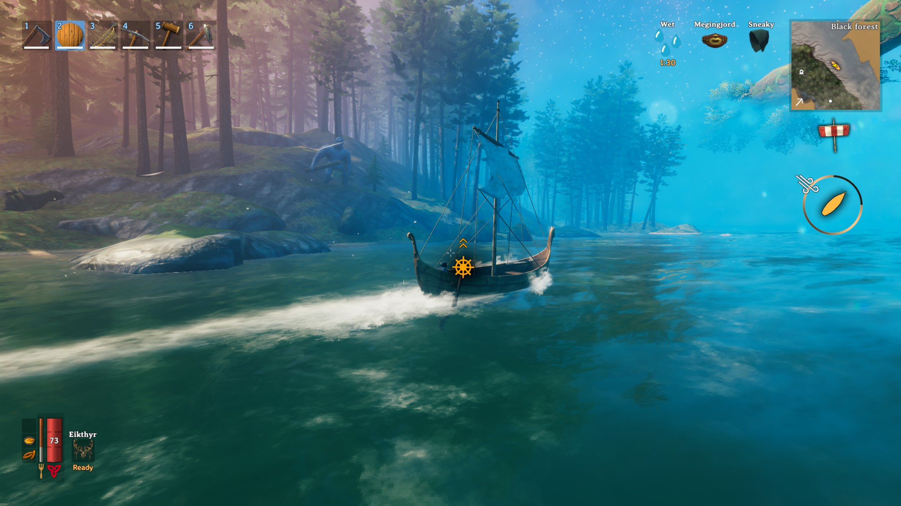
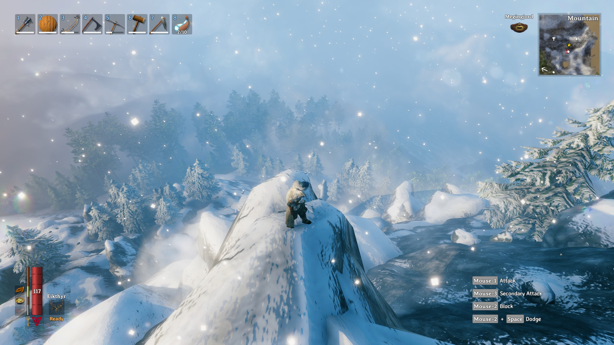
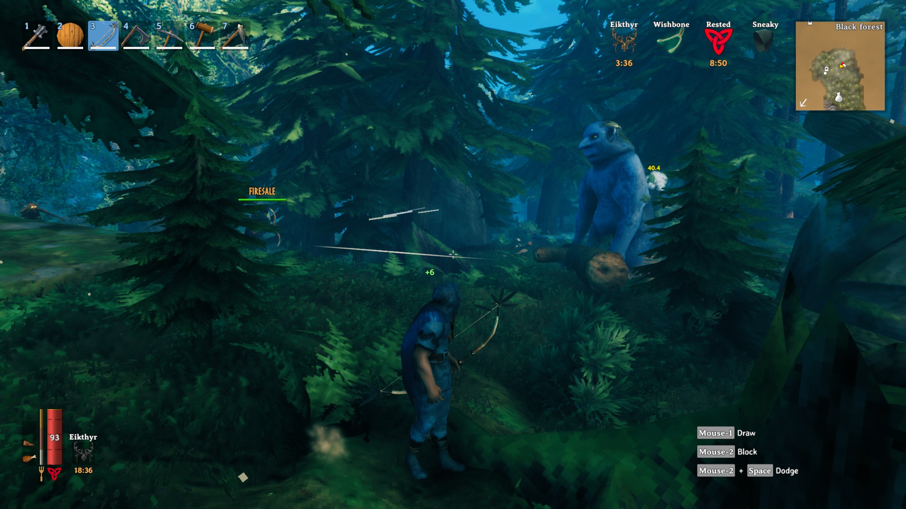

I've got Valheim a couple of days ago and I'm already 30 hours in and we just got to the late(ish) game at least for the time being, it's early access still) we are not yet done with building the best gear possible and we still have not beaten all bosses. It is super fun to play together and push the limits.

The difficulty is challenging which I like a lot. Once you get metal gear you really feel much stronger but when you don't have good food you're still basically as strong as a new player. I like the system where you level all things by using and not having classic levels etc.

https://imgur.com/a/ou0cebg

## What's different

Building is unique and the snapping / grid is super awesome. Much better building than in other comparable games. It is not as static and squarish as other games. You can turn objects about 5°-10° per rotation and it allows to adjust your building quite good. There is a good selection of building blocks for houses and for defence.

Digging is satisfying aswell. The world is very organic and you can dig relatively deep before you are stopped. The depth is limited though and you can't dig tunnels. But you can do what is needed: Level areas, dig trenches and build natural walls.

Physics is one of the core features that I love. When you chop down trees, they turn physical and fall on other trees which then damages these other trees and might fall over aswell. This is lots of fun but mind your head.

Skill leveling is awesome. You get better by doing things a lot and not by leveling a character. It feels really refreshing to not have character levels and by just doing what you want.

The world is generated but feels very alive and believable. There are landmarks like stones arranged to a graveyard and when you dig there you actually find treasure. The ships keep you wondering where the next island is and how to get there fast. And on top of that, the lighting (and lightning) just looks gorgeous.

And lastly the dungeons and monsters. This game has some variation in enemies and we found new enemy types after 30 hours of gameplay because we got to a new biome that we were not able to survive in before. There are different dungeon types throughout the world which you can and have to explore.

## The screenshots

And as always, here are the best of Screenshots on imgur and you can find the entire set of screenshots on my Steam profile here [https://steamcommunity.com/id/Thecell/screenshots/?appid=892970&sort=oldestfirst&browsefilter=myfiles&view=imagewall](https://steamcommunity.com/id/Thecell/screenshots/?appid=892970&sort=oldestfirst&browsefilter=myfiles&view=imagewall).

Update: There was a good analysis article released about the design of Valheim and why it has such a good pacing: [https://www.polygon.com/2021/3/8/22311846/valheim-design-secret-negative-space-player-trust-pacing-boss-battles-building](https://www.polygon.com/2021/3/8/22311846/valheim-design-secret-negative-space-player-trust-pacing-boss-battles-building) or if the link should be dead at some point: [https://web.archive.org/web/20210309171623if\_/https://www.polygon.com/2021/3/8/22311846/valheim-design-secret-negative-space-player-trust-pacing-boss-battles-building](https://web.archive.org/web/20210309171623if_/https://www.polygon.com/2021/3/8/22311846/valheim-design-secret-negative-space-player-trust-pacing-boss-battles-building)
