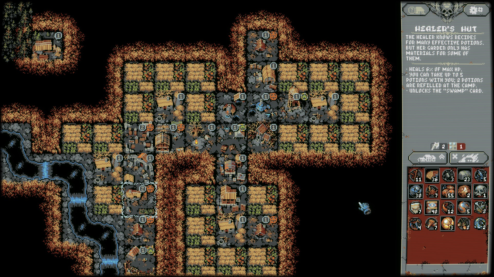
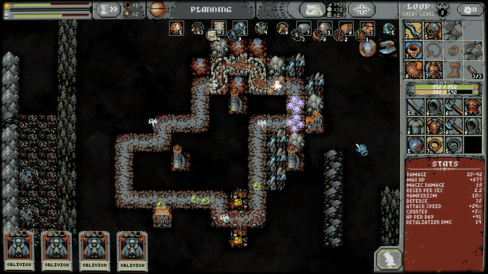
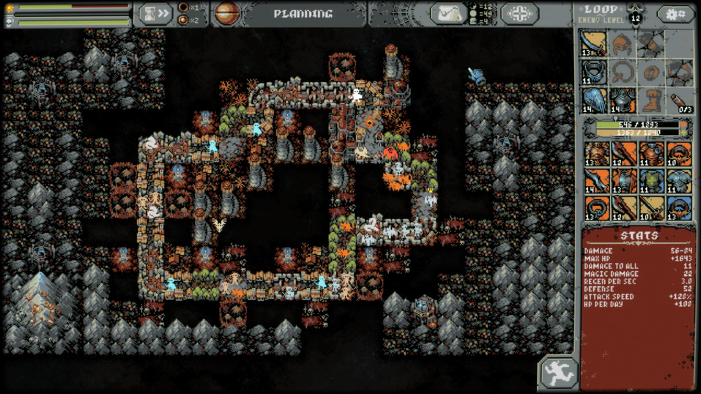

https://imgur.com/a/OLY7g8r

I've looked at Loop Hero screenshots for several days thinking it looks good but is probably not really my thing. I then started playing and found out it indeed was the right fit for me. Going through a run and having to decide if I can make another round or take the resources back is challenging and super fun. When playing the game time flies so fast. Let's jump in.

The game contains two main gameplay loops. The base you build and where you return to after each expedition, is basically your progress and it's where the roguelike comes into play. Items you found can be equipped here to give you a boost for all future runs. However, more importantly are the buildings you can set up with the resources you gathered in your runs. These buildings unlock new cards which then can be used on your next expeditions.

The main gameplay loop is the expedition. It's a randomly generated loop and your hero will run this loop over and over until you stop or die. Sounds simple, yet it's quite intricate. Before every loop you chose which land cards will drop during your expedition and these are used to buff your hero, make the loop harder and gather more resources. You want the loops to be hard but not too hard to extract the maximum number of resources for a given run. There are limits to the runs: When you place too many tiles, a boss will appear on the camp tile who you'll have to face before you continue your loop. The second limit is, that enemies get stronger each loop. You can get stronger by equipping random items dropped by these creatures, but it can get very hard.

There are a lot of systems interacting here. For example there are mountain and rock cards. Rocks give less HP than mountains so you maybe want to wait for the rare cards to drop. But waiting means you will have less HP and your hero runs rounds no matter what. Also, you can only store a fixed number of cards before the game automatically burns your oldest cards.

Then there are side-effects to most cards. Place a meadow near any other field and it will restore more HP than when you have a field of meadows. 3x3 rocks generate a mountain (only once) which gives lots of extra HP. Setting rocks near rocks gives extra hp and so on. But create a mountain and you'll have to fight a harpy that is spawned every couple of days and just settles on a random walkway tile.

So just the building is a very finetuned system and an equal amount of stat juggling goes into your hero equipment. It's fascinating how many interactions can be accounted for while playing the game.

As always, here are the best of Screenshots on imgur and you can find the entire set of screenshots on my Steam profile here [https://steamcommunity.com/id/Thecell/screenshots/?appid=1282730&sort=oldestfirst&browsefilter=myfiles&view=imagewall](https://steamcommunity.com/id/Thecell/screenshots/?appid=1282730&sort=oldestfirst&browsefilter=myfiles&view=imagewall).
