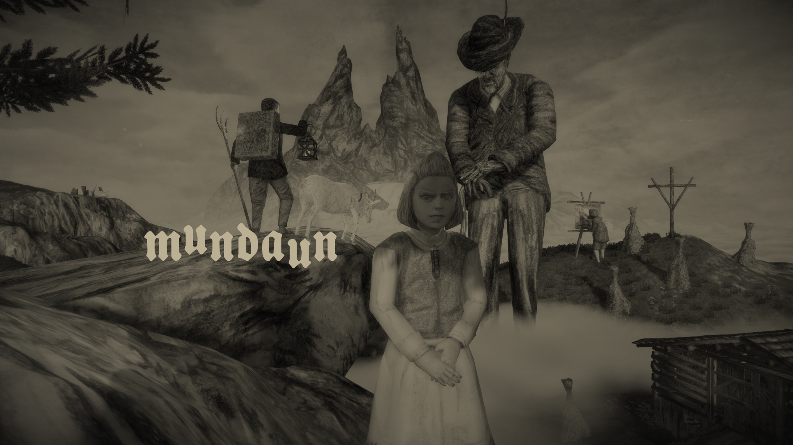
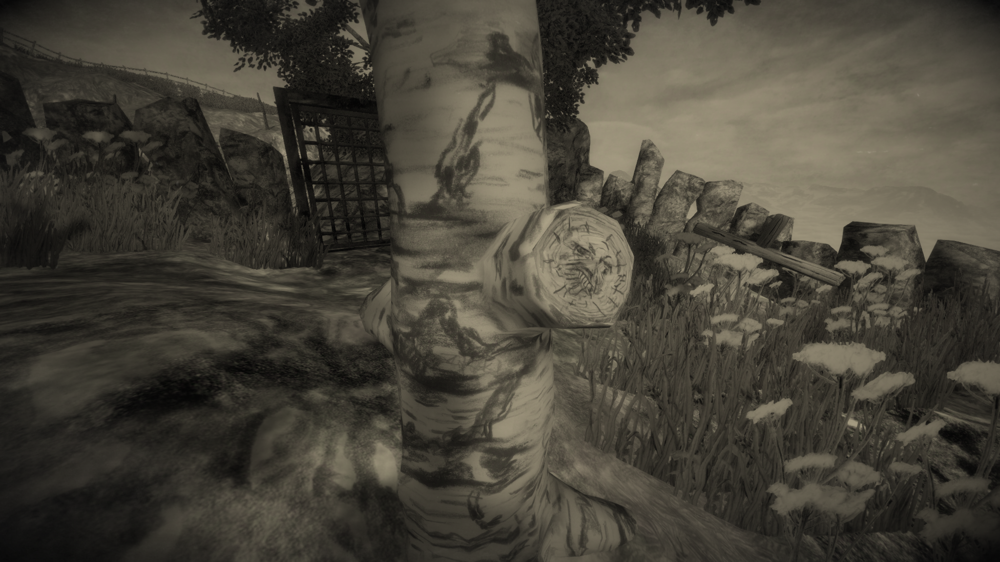
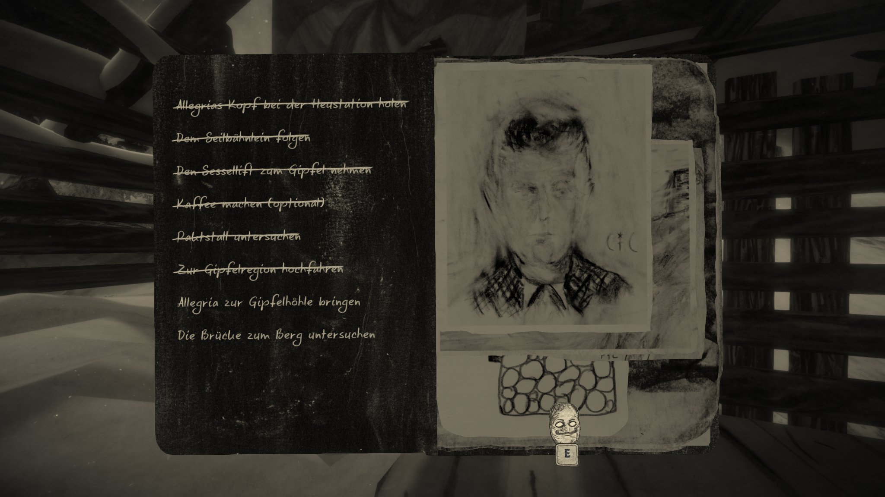
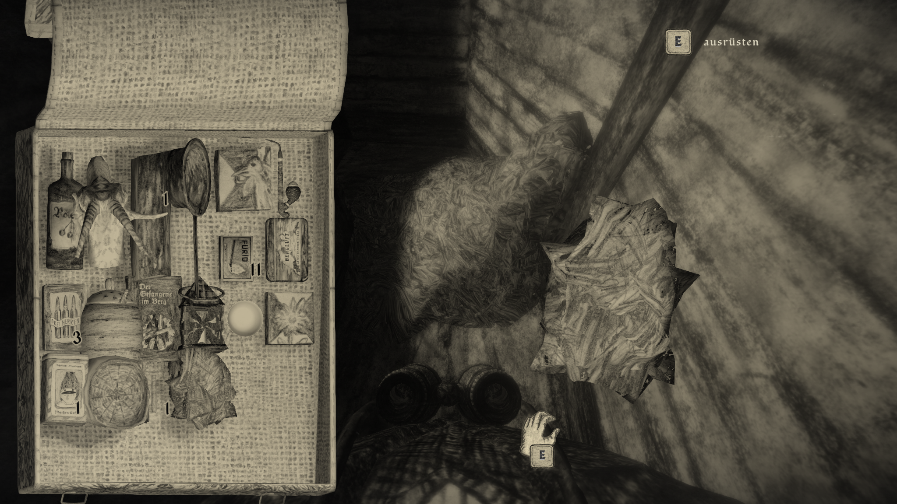

https://imgur.com/a/HQCoyH5

This is not one of my usual "impressions from" and is biased because: **I worked on this game!!** Yes, I am part of the team for almost a year, a dream come true and I can't thank Michel enough for this chance. It is my great pleasure to see this work come to life. At first I've optimized lots of systems to get the development for pc to reasonable performance again. After that I worked on various subsystems and squashed bugs and now we had a couple of months where we just had to optimize optimize optimize and polish.

Because this is still the impressions from We'll take a look at the story, optics and audio for the rest of this blog. First of all, I've played the game over and over. I'm not a reliable source of how good the story works and how self-explanatory the game is to a new player. There are scenes that still after all this playing work quite well. It's a game influenced by old swiss folklore and myths. You go back to Mundaun because your grandpa tragically died, but there seems to be more going on.

The visuals are amazing. Everything in the game is hand penciled by Michel Ziegler [@dasmirts](https://twitter.com/dasmirts) (and his son) and there are SO MANY details and paintings in there. Just yesterday after playtesting for days, I discovered that a birch stump had a secret face drawn on it. The game is completely black and white with a sepia tint wich suites the atmosphere and the time it plays in very well.

The game has basically no ingame UI, everything is neatly packed away in the journal you are carrying. Only hints and textboxes are displayed directly during gameplay. You can drink coffee to be less afraid. You can eat to get more hp and you can read rifle manuals to get a calmer aim. You can find all these stats in the journal.

Besides the journal there is your backpack in which you store items you have found, and you can inspect those items by rotating them around.

The audio in this game is awesome, both music and voice. The games voices are exclusively spoken in romansh which is the often forgotten 4th official language of Switzerland. There are roughly 60'000 romansh speakers in Switzerland (counted in the year 2000). I find this beautiful and fascinating, to have a modern game use this language for the narration and keeping this language alive.

And last but not least: The sound design is made by Eric Lorenz [@escarbanzo](https://twitter.com/escarbanzo) who did a terrific job to say the least. Additionally the music was partially licensed (radios) and partially made by Michel Barengo [@MichelBarengo](https://twitter.com/michelbarengo). It's so nice to just sit down and listen to the music even after multiple playthroughs.

You can find the entire set of screenshots on my Steam profile here [https://steamcommunity.com/id/Thecell/screenshots/?appid=720350&sort=oldestfirst&browsefilter=myfiles&view=imagewall](https://steamcommunity.com/id/Thecell/screenshots/?appid=720350&sort=oldestfirst&browsefilter=myfiles&view=imagewall).
