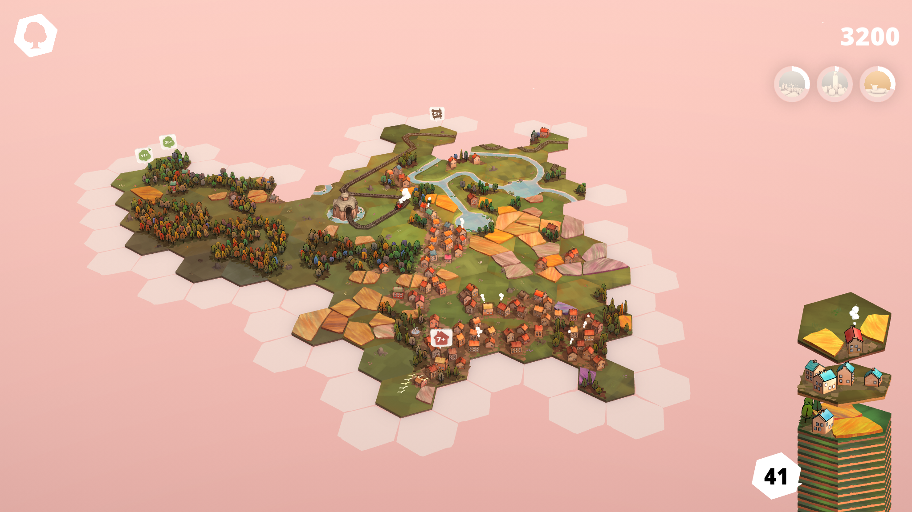

https://imgur.com/a/utE3S1b

The game is super fun to play for everyone who likes to puzzle, but also likes to look ahead so that you won't put yourself in a misery later on. You have to develop a kind of feeling for what tiles are common and what to avoid. You can always put blocks together somehow, later on you will find that the gaps you have created are filled with the most unlikely blocks.

The music is very relaxing and suits the game quite well. It's a nice background soundtrack to just put on and would be a great for studying too.

I made it to 46'070 which is at the time of writing world place #48 (there are 146'224 leaderboard places with 50 points or more). To be honest I would not have gone so far if it was not for the two streamers Marcus and Lena challengeing each other. The indiestrolche [https://www.twitch.tv/indiestrolche](https://www.twitch.tv/indiestrolche) are a great bunch and Marcus challenged Lena [https://www.twitch.tv/layna\_live](https://www.twitch.tv/layna_live) to get to the highest points. It was the easter weekend and I had plenty of time for myself. It was so nice to talk to these two over those days, and I felt very at home in the discord where there was a little highscore going on lovingly called the Dorfpranger (village pillory).

As always, here are the best of Screenshots on imgur and you can find the entire set of screenshots on my Steam profile here [https://steamcommunity.com/id/Thecell/screenshots/?appid=1455840&sort=oldestfirst&browsefilter=myfiles&view=imagewall](https://steamcommunity.com/id/Thecell/screenshots/?appid=1455840&sort=oldestfirst&browsefilter=myfiles&view=imagewall).
