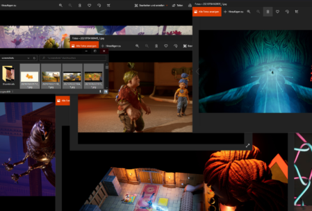

After beeing sensibilised to the slow decline of software and having a creeping feeling for years I have come to the point where I should start adding to this post whenever I find softwareproblems and remember that this post exists.

## What is the problem?

In short: Most software ultimately still does the same things as software 10 years ago but it looks a bit better. The tradeoff is, that it is unproportionally slower. All of this while hardware got 5 to 15 times faster in the last 10 years alone. (147,600 MIPS vs 749,070 MIPS or 2,356,230 MIPS [src](https://en.wikipedia.org/wiki/Instructions_per_second)).

**Where did I notice that?** At my first job we had a custom software that allowed us to put in our hours worked and on what client order. The software was by 2007 standard very old school, it looked like a Windows 98 software. But guess what, if you wanted and learned how to use it you could use it very efficiently. You could jump through the tables and input fields by tab and everything entered was immediately saved. It was VERY responsive.

**What happened since then?** Everything moved to the web and native software becoming bloated. Using hundreds of libraries to get things done is the norm. Normal multiplatform software got complicated for a variety of reasons so we started using web as a solution. If you need more performance, the "modern" way is to use docker to have a "stable" base environment to run our software in because the underlying OS got so unreliable. The solution is litterally to put software on top of a virtual environment on top of the OS environment. Really.

Casey Muratori every so often reminds people and shows people how fast computers really are. Look at this command line demonstration and a reference implementation of a command prompt that demonstrates how fast it **could** be. You can try out the reference here [https://github.com/cmuratori/termbench/tree/v3\_work](https://github.com/cmuratori/termbench/tree/v3_work), it has support for all kinds of languages and typefaces too.

https://www.youtube.com/watch?v=99dKzubvpKE

Now a quite good analysis of the software problem is covered in this talk by Jonathan Blow. It explains so much of the current problems so well.

https://www.youtube.com/watch?v=ZSRHeXYDLko

## Encounters

- **25.07.2021** I went through most of the 1470 screenshots of it takes two with the "modern" windows image viewer. I can't reproduce this bug now but I wrote down how many photos I was able to go through before I could not click the next button (it simply disappeared). It was 228 photos, 241, 197, 197, 242, 212. On the screenshot you can see on the top right window that there is a back button (<) but no next (>) button anymore for whatever reason. Basically, the application failed to do the one job it was originally designed to do.

- **26.07.2021** We have a software stack at work that relies on the azure build pipeline. Today we pushed lots of builds and builds were constantly failing because of installation problems in the pipeline. Not in the code. One of our staff members even opened an issue on the Microsoft azure pipeline Github over this: [https://github.com/microsoft/azure-pipelines-tasks/issues/15086](https://github.com/microsoft/azure-pipelines-tasks/issues/15086) (and got 23 upvotes in the first 8 hours). So we basically get limited by the build pipeline because the pipeline got a 404. When calling the url directly it worked.
- **28.07.2021** I have an HP elitebook laptop for work and an HP 2013 UltraSlim Docking station. Whenever I use the wlan instead of a cable connection Windows just shows that it has no internet connection. Internet works perfectly fine. Sounds like a really hard problem to solve...
- **08.08.2021** I've been going through a couple of foto folders and noticed a windows bug. The Order by Name is beeing reset whenever I use a filter by type. Replicate: Have folders with images. Sort by name descending. Go into a folder, click the type dropdown and select a file ending (jpeg). See images beeing filtered. Go one folder up and see folder names ordered ascending instead.

