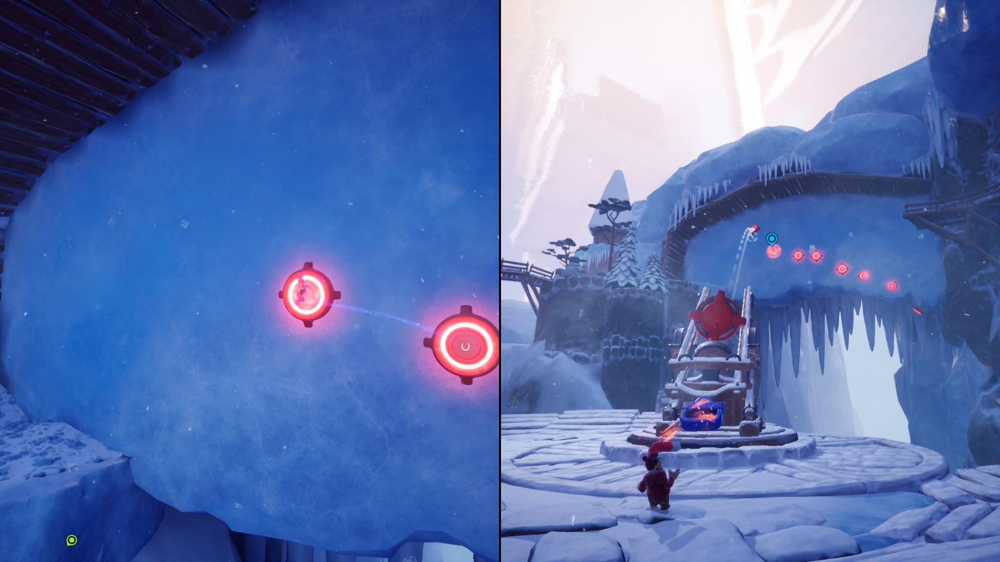
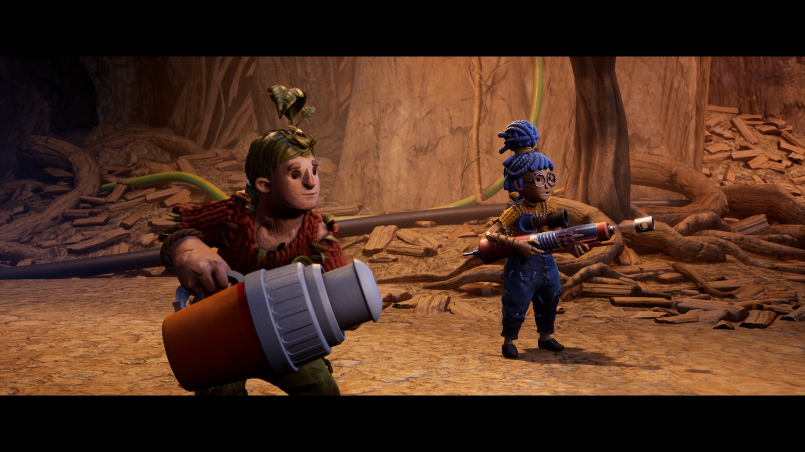

https://imgur.com/a/Sivp1TY

I've dived into It Takes Two without playing the previous game "A Way Out" of the studio Hazelight. The game is only playable in coop and the story is about a couple with a kid thinking about divorce. The game then puts the two (and therefore you) into a situation where you can only get back to normal by cooperating. As the two characters struggle to get along, so are you.

I love **how good the game works** and how well-made this entire experience is. At the start the couple is fighting a lot and it's the same for you as a player (although for slightly different reasons). You will have to figure out how to play together, whos idea to try and how the mechanics work, and naturally you will have a few attempts at this. As the game progresses, the couple will get along better and if you take time to reflect on your own experience you'll notice that you too will work much better together compared to the start of the game.

Speaking of working together, here are **a couple of words about the mechanics**. The game stays fresh until the very end. There are so many different mechanics and ideas that even [What Remains of Edith Finch](https://blog.thecell.eu/blog/2018/07/22/the-impressions-from-what-remains-of-edith-finch/) would be jealous. Every mechanic is well thought through and presents you with a set of challenges often coming up with creative problems to solve. (As a little example: Each player has gets a color-coded part of a magnet. Red and red repel, blue and red attract. The level then presents some color-coded interactables. Now one player can get up by ledge by simply repelling from the red magnet on the floor but the other will have to find another way to get up the ledge and so on)

Each player gets a set of abilities different from the other, and **the game often times has asymmetric gameplay** where you have to help each other out. (Another example: One player gets some kind of fire arrow shooting device and the other gets a resin gun. The player with the resin then has to cover an enemy in resin, and the fire shooter will have to set it aflame. Each one can't solve the encounter, and you will have to talk to each other to get through the level.)

The Last part I found really appealing is **the pacing, the frequent cinematics** in between (flawlessly transitioning into gameplay) and the fantastic graphics. The frequent cinematics help understand what the characters are going through and what they are struggling with. It gives you as a player a small break from gameplay and gives you a chance to process what you just went through and how this might have affected the relationship of the characters (and yours to an extent). All in all this was a very worthwhile time and combines great mechanics, gameplay and story.

As always, here are the best of Screenshots on imgur and you can find the entire set of screenshots on my Steam profile here [https://steamcommunity.com/id/Thecell/screenshots/?appid=1426210&sort=oldestfirst&browsefilter=myfiles&view=imagewall](https://steamcommunity.com/id/Thecell/screenshots/?appid=1426210&sort=oldestfirst&browsefilter=myfiles&view=imagewall).
