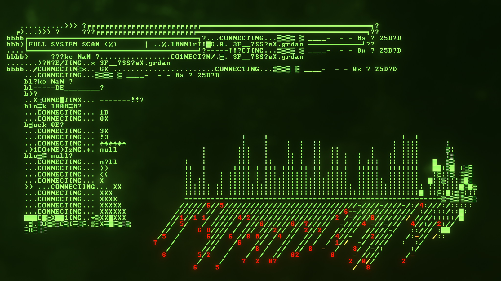

https://imgur.com/a/h1hChIn

I played an early demo of this game during Gamescom 2019 while I was a booth volunteer and I remember talking to Phi Dinh about the game. I was following him for quite some time before that and the game felt great already. A couple of days ago, I was finally able to play the finished game. They upgraded the graphics pipeline and the game looks just mindblowing.

****About the mechanics****: The game is a combination of platforming, shooting, puzzles, and searching for the next part to play and unlock. The most fun for me is definitely the platforming. You start out pretty weak and upgrade yourself with new modules like jumping, double jumping, dash, and so on. You are playing as a virus, recovering a system and installing yourself on it. That's why you start out so weak at first.

A couple of words about the **most unique part** of the game: The freaking ASCII overlay! Never have I seen a more beautiful ASCII overlay in a game. As far as I remember, they wrote a shader that allowed them to render perfectly crisp ASCII symbols all over the screen and animate them however they like.

As always, here are the best of Screenshots on imgur and you can find the entire set of screenshots on my Steam profile here [https://steamcommunity.com/id/Thecell/screenshots/?appid=986310&sort=oldestfirst&browsefilter=myfiles&view=imagewall](https://steamcommunity.com/id/Thecell/screenshots/?appid=986310&sort=oldestfirst&browsefilter=myfiles&view=imagewall).
