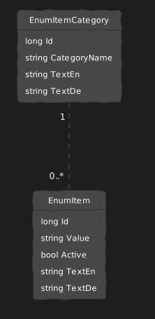
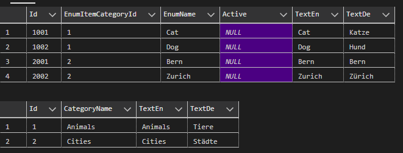

This is just a little writeup of how we handle and store Enums. Maybe this will help other devs. We save our Enums in the Database, and long story short there is an UML, an example to create the DB Tables with example entries. Short explanation after the code.

<figure>

[](https://blog.thecell.eu/wp-content/uploads/2023/11/grafik-1.png)

<figcaption>

UML

</figcaption>

</figure>

<figure>

[](https://blog.thecell.eu/wp-content/uploads/2023/11/grafik-2.png)

<figcaption>

SELECT Results

</figcaption>

</figure>

```
CREATE TABLE EnumItemCategories (
    Id bigint NOT NULL,
    CategoryName nvarchar(255) NOT NULL,
    TextEn nvarchar(255) NOT NULL,
    TextDe nvarchar(255),
    PRIMARY KEY (Id));

CREATE TABLE EnumItems (
    Id bigint NOT NULL,
    EnumItemCategoryId bigint NOT NULL,
    EnumName nvarchar(255) NOT NULL,
	Active bit,
	TextEn nvarchar(255) NOT NULL,
	TextDe nvarchar(255),
    PRIMARY KEY (Id),
    FOREIGN KEY (EnumItemCategoryId) REFERENCES EnumItemCategories(Id));

INSERT INTO EnumItemCategories (Id, CategoryName, TextEn, TextDe) VALUES (1, 'Animals', 'Animals', 'Tiere'), (2, 'Cities', 'Cities', 'Städte')
INSERT INTO EnumItems (Id, EnumItemCategoryId, EnumName, TextEn, TextDe) VALUES (1001, 1, 'Cat', 'Cat', 'Katze'), (1002, 1, 'Dog', 'Dog', 'Hund')
INSERT INTO EnumItems (Id, EnumItemCategoryId, EnumName, TextEn, TextDe) VALUES (2001, 2, 'Bern', 'Bern', 'Bern'), (2002, 2, 'Zurich', 'Zurich', 'Zürich')

SELECT * FROM EnumItems
SELECT * FROM EnumItemCategories
```

**Pro**

- Dynamically add new Enums

- Enums come with displaynames

- Update Typos or Translations on the fly

- Database Tables can Reference the EnumItems as ForeignKeys

**Con**

- Foreignkey constraint is not perfect -> Wrong EnumItem can be referenced (You will want to validate values in your backend)

The Active bool is just an information. You will need 2 methods in your frontend, one that loads all enums and one that filters just the active enums. This is because you want to display already saved values even if the enum is now inactive to be selected. But dropdowns should only display active enums.
