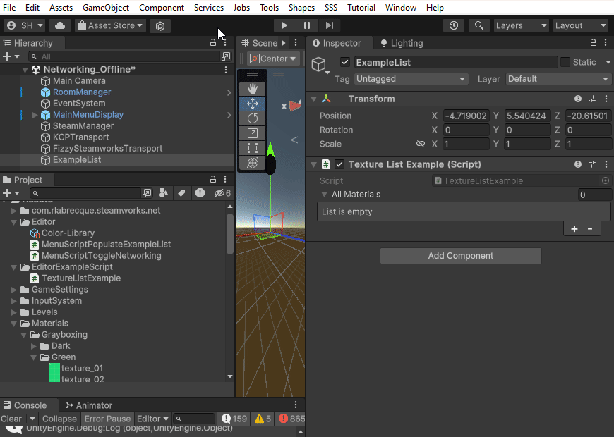

[](https://blog.thecell.eu/wp-content/uploads/2023/11/2023.11.18_TextureListExample.gif)

Just a quick tutorial on Editorscripts. They can be quite useful and make your life easier, preprocess assets or streamline your workflow. In This example I am populating a gameobject with a bunch of textures that I've added to my project. In this example I need a gameobject in the scene which has the TextureListExample MonoBehaviour. I need to have that scene open and then I can use my custom menu tool to repopulate my gameobject references. The script must be created inside a folder called **Editor** somewhere in the Assets folder hierarchy.

**TextureListExample.cs**

```csharp
using System.Collections.Generic;
using UnityEngine;

public class TextureListExample : MonoBehaviour
{
    [SerializeField] private List<Texture2D> allMaterials = new List<Texture2D>();

    public void SetMaterials(List<Texture2D> materials)
    {
        allMaterials = materials;
    }
}
```

**MenuScriptPopulateExampleList.cs**

```csharp
using System.Collections.Generic;
using System.IO;
using UnityEditor;
using UnityEngine;

#nullable enable

public class MenuScriptPopulateExampleList
{
    [MenuItem("SSS/PopulateExampleList %&e")]
    public static void PopulateExampleList()
    {
        Debug.Log("Repopulating Texture List");
        var textureListExample = GameObject.FindFirstObjectByType<TextureListExample>();

        if (textureListExample != null)
        {
            var textures = new List<Texture2D>();

            var assetPath = Path.Combine("Assets", "Materials");
            var assetFolders = AssetDatabase.GetSubFolders(assetPath);
            var textureGuids = AssetDatabase.FindAssets("t:Texture2D", assetFolders);
            foreach (var guid in textureGuids)
            {
                var texture = AssetDatabase.LoadAssetAtPath<Texture2D>(AssetDatabase.GUIDToAssetPath(guid));
                textures.Add(texture);
            }

            textureListExample.SetMaterials(textures);
            EditorUtility.SetDirty(textureListExample);
        }
        else
        {
            Debug.LogError("No TextureListExample in this Scene");
        }
    }
}
```

Helpful references

- [https://learn.unity.com/tutorial/editor-scripting#5c7f8528edbc2a002053b5fa](https://learn.unity.com/tutorial/editor-scripting#5c7f8528edbc2a002053b5fa)

- [https://docs.unity3d.com/ScriptReference/AssetDatabase.html](https://docs.unity3d.com/ScriptReference/AssetDatabase.html)

- [https://docs.unity3d.com/ScriptReference/EditorUtility.html](https://docs.unity3d.com/ScriptReference/EditorUtility.html)
